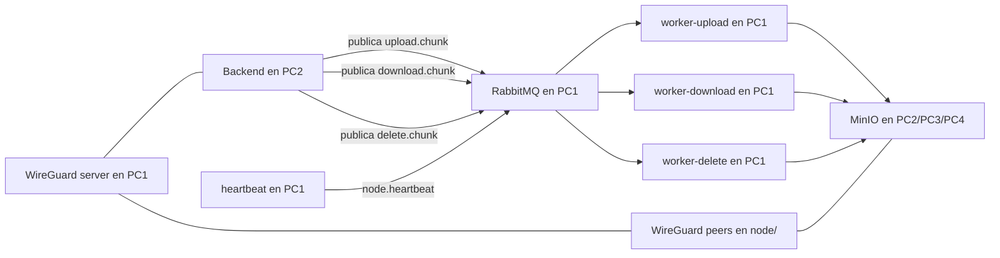

# Rudy-Drive Distributed Stack

Este directorio contiene la capa de infraestructura de Rudy-Drive para PC1.

El objetivo es ejecutar la plataforma de mensajería, workers y WireGuard del servidor de forma independiente del resto de PCs. Los nodos de almacenamiento viven en [node/README.md](node/README.md).

## Qué Hace Este Stack

El stack proporciona:

- Almacenamiento distribuido de objetos con MinIO
- Mensajería asíncrona con RabbitMQ
- VPN privada con WireGuard
- Workers para carga, descarga, borrado, latidos, salud y logging
- Contratos Python compartidos para que backend y workers hablen el mismo idioma

El sistema está pensado primero como infraestructura. El backend se construirá después sobre los mismos contratos y se desplegará en el bundle de nodos.

## Arquitectura General



## Servicios

### Bundle De Nodos MinIO

MinIO es la capa de almacenamiento y se despliega fuera de PC1.

Servicios:

- `node/` para PC2
- `node/` para PC3
- `node/` para PC4

Cada máquina levanta un `wireguard-peer` y un `minio` dentro del mismo bundle.

Distribución de almacenamiento:

- cada nodo monta `data` y `data2`
- el clúster usa endpoints WireGuard como `10.0.0.2`, `10.0.0.3` y `10.0.0.4`
- `node/` contiene el `docker-compose.yml` y el `wg0.conf` que se entrega por máquina

Por qué importa:

- el proyecto necesita almacenamiento de objetos distribuido
- erasure coding requiere varios endpoints de almacenamiento
- el bundle de nodos permite desplegar PC2, PC3 y PC4 con el mismo layout

### RabbitMQ

RabbitMQ es el broker de mensajería asíncrona.

Puertos expuestos:

- `5672` para clientes AMQP
- `15672` para la consola de administración

Colas definidas actualmente:

- `upload.chunk`
- `download.chunk`
- `delete.chunk`
- `node.heartbeat`
- `async.queue` para el contrato genérico asíncrono que ya existe en el stack

RabbitMQ es la capa de coordinación entre el backend y los workers.

### VPN WireGuard

WireGuard proporciona una red privada entre los nodos.

Topología:

- `10.0.0.1` -> servidor central de WireGuard en PC1
- `10.0.0.2` -> PC2
- `10.0.0.3` -> PC3
- `10.0.0.4` -> PC4

El servidor vive en [wireguard/server/wg0.conf](wireguard/server/wg0.conf) y cada nodo usa su propio `wg0.conf` dentro de `node/wireguard/`.

### Workers

Los daemons de worker están construidos sobre una base Python compartida y corren en PC1.

Servicios:

- `worker-upload`
- `worker-download`
- `worker-delete`
- `heartbeat`

Responsabilidades:

- `worker-upload`: recibe solicitudes de carga y guarda chunks en MinIO
- `worker-download`: recibe metadata de chunks y reconstruye bytes desde MinIO
- `worker-delete`: elimina todos los objetos de chunk de un archivo subido
- `heartbeat`: publica mensajes periódicos de salud de nodos en RabbitMQ cada 10 segundos

## Contratos Python Compartidos

El SDK reutilizable vive en `workers/shared/`.

Módulos importantes:

- `config.py`
- `rabbitmq_client.py`
- `minio_client.py`
- `chunk_storage.py`
- `chunk_recovery.py`
- `chunk_metadata.py`
- `queue_worker.py`
- `health.py`
- `worker_logger.py`

Estos archivos son la capa contractual para backend y workers.

## Funciones Más Importantes

Estas son las funciones y clases que usarás con más frecuencia.

### `load_settings()`

Lee variables de entorno y devuelve la configuración en tiempo de ejecución para RabbitMQ, MinIO y el tamaño de los chunks.

Úsala cuando arranque un worker o un servicio backend.

### `ChunkStorage.store_bytes(upload_id, data)`

Divide un payload de bytes en chunks y los guarda en MinIO bajo `upload_id/chunk_<index>`.

Úsala cuando ya tienes los datos en memoria.

### `ChunkStorage.store_stream(upload_id, stream)`

Divide un objeto tipo archivo en chunks y guarda cada chunk en MinIO.

Úsala para subidas por streaming o archivos grandes.

### `ChunkStorage.store_file(upload_id, file_path)`

Envoltorio cómodo sobre `store_stream()` para archivos locales.

### `ChunkRecoveryWorker.recover_bytes(chunks)`

Descarga cada objeto de chunk desde MinIO y concatena los bytes en orden de `chunk_index`.

Úsala para reconstruir un archivo desde su metadata.

### `RabbitMQClient.publish(queue_name, payload)`

Serializa un payload JSON y lo publica en RabbitMQ.

Úsala desde el backend o desde otro productor para enviar trabajo a los workers.

### `QueueWorker.run()`

Arranca un proceso worker que consume una cola de RabbitMQ y llama a un handler por cada mensaje.

Úsala como bucle base para workers personalizados.

### `build_health_router(rabbitmq_client, minio_client)`

Construye un router de FastAPI con `/health` que comprueba RabbitMQ y MinIO.

Úsala en cualquier servicio que necesite un endpoint de salud.

### `WorkerLogger.worker_started()`, `message_received()`, `upload_success()`, `upload_failed()`

Escribe eventos estructurados en `logs/worker.log`.

Úsalas para mantener consistencia operacional entre workers.

## Conceptos Principales

### Flujo de Subida

Una solicitud de subida se divide en chunks:

```text
upload request
  -> chunk_0
  -> chunk_1
  -> chunk_2
  -> ...
```

Cada chunk se guarda en MinIO usando este patrón de nombres:

```text
<upload_id>/chunk_<index>
```

Ejemplo:

```text
76ab5da2d92a42d791d96ccbfd132e5e/chunk_0
76ab5da2d92a42d791d96ccbfd132e5e/chunk_1
76ab5da2d92a42d791d96ccbfd132e5e/chunk_2
```

### Flujo de Recuperación

La recuperación lee la metadata de los chunks, descarga cada chunk desde MinIO, ordena por `chunk_index` y concatena los bytes para reconstruir el payload original.

### Flujo de Logging

Los workers emiten eventos estructurados para:

- `worker started`
- `message received`
- `upload success`
- `upload failed`

Los logs se escriben en `logs/worker.log`.

## Contrato de Metadata de Chunks

El objeto de metadata usado por backend y workers es:

- `id`: UUID del registro del chunk
- `file_id`: identificador lógico del archivo
- `node`: nombre del nodo
- `chunk_index`: posición del chunk en el archivo
- `object_name`: ruta del objeto en MinIO

Ejemplo:

```python
ChunkMetadata(
    id="chunk-uuid",
    file_id="file-uuid",
  node="pc2",
    chunk_index=0,
    object_name="upload-uuid/chunk_0",
)
```

## Contratos de Mensajería

Los workers escuchan colas de RabbitMQ y esperan payloads JSON.

### `upload.chunk`

Propósito: guardar un archivo como objetos chunk en MinIO.

Payload de ejemplo:

```json
{
  "upload_id": "76ab5da2d92a42d791d96ccbfd132e5e",
  "data_base64": "YWJjZGVmZw=="
}
```

Campos soportados:

- `upload_id` requerido
- `data_base64` opcional, recomendado para binarios
- `data` opcional, fallback de texto UTF-8 para demos

### `download.chunk`

Propósito: reconstruir bytes a partir de una lista de metadata de chunks.

Payload de ejemplo:

```json
{
  "chunks": [
    {
      "id": "chunk-1",
      "file_id": "file-1",
      "node": "pc2",
      "chunk_index": 0,
      "object_name": "76ab.../chunk_0"
    },
    {
      "id": "chunk-2",
      "file_id": "file-1",
      "node": "pc3",
      "chunk_index": 1,
      "object_name": "76ab.../chunk_1"
    }
  ]
}
```

### `delete.chunk`

Propósito: borrar todos los objetos chunk que pertenecen a una subida.

Payload de ejemplo:

```json
{
  "upload_id": "76ab5da2d92a42d791d96ccbfd132e5e"
}
```

### `node.heartbeat`

Propósito: publicar mensajes periódicos de liveness del worker o nodo.

Payload de ejemplo:

```json
{
  "node": "heartbeat",
  "timestamp": "2026-05-30T04:13:55.969030+00:00",
  "status": "alive"
}
```

## Cómo Ejecutar

Desde este directorio levantas PC1:

```bash
docker compose up -d
```

Eso levanta:

- 1 broker RabbitMQ
- 3 workers
- 1 servidor WireGuard y sus peers

Para levantar un nodo en PC2, PC3 o PC4 usa el bundle de [node/README.md](node/README.md).

Para ver el estado:

```bash
docker compose ps
```

Para ver logs:

```bash
docker compose logs -f rabbitmq
docker compose logs -f worker-upload
docker compose logs -f worker-download
docker compose logs -f worker-delete
```

## Consolas Web Y Puertos

Consola de RabbitMQ:

- `http://localhost:15672`

Consola de MinIO:

- `http://localhost:9001` en cada nodo local del bundle `node/`

Logs de workers:

- `logs/worker.log`

Endpoint UDP de WireGuard:

- `51820`

## Cómo Se Comunican Los Servicios

### RabbitMQ hacia los Workers

El backend o cualquier productor publica un mensaje JSON en una de las colas.

El worker consume el mensaje, realiza la acción de almacenamiento y registra el resultado.

### Workers hacia MinIO

El worker de subida guarda objetos chunk en MinIO.

El worker de recuperación descarga esos objetos y reensambla los bytes del archivo.

El worker de borrado elimina todos los objetos bajo el prefijo de subida.

### Probes de Salud

Las comprobaciones compartidas validan:

- conectividad con RabbitMQ
- conectividad con MinIO

Si cualquiera falla, el endpoint de salud devuelve `503`.

## Cómo Llamar Las Funciones Compartidas Desde Otro Sistema

Si quieres integrar otro servicio con Rudy-Drive, usa el SDK Python compartido.

### Subir Chunks

```python
from workers.shared.chunk_storage import ChunkStorage
from workers.shared.config import load_settings
from workers.shared.minio_client import MinIOClient

settings = load_settings()
storage = ChunkStorage(minio_client=MinIOClient(settings.minio), chunking=settings.chunking)
records = storage.store_bytes("upload-uuid", b"hello world")
```

### Recuperar Bytes

```python
from workers.shared.chunk_metadata import ChunkMetadata
from workers.shared.chunk_recovery import ChunkRecoveryWorker
from workers.shared.config import load_settings
from workers.shared.minio_client import MinIOClient

settings = load_settings()
recovery = ChunkRecoveryWorker(minio_client=MinIOClient(settings.minio))
chunks = [
    ChunkMetadata(
        id="chunk-1",
        file_id="file-1",
        node="pc2",
        chunk_index=0,
        object_name="upload-uuid/chunk_0",
    )
]
data = recovery.recover_bytes(chunks)
```

### Enviar Un Mensaje A RabbitMQ

```python
from workers.shared.config import load_settings
from workers.shared.rabbitmq_client import RabbitMQClient

settings = load_settings()
client = RabbitMQClient(settings.rabbitmq)
client.publish("upload.chunk", {"upload_id": "upload-uuid", "data": "hello"})
```

### Comprobar Salud

```python
from workers.shared.config import load_settings
from workers.shared.health import check_minio, check_rabbitmq
from workers.shared.minio_client import MinIOClient
from workers.shared.rabbitmq_client import RabbitMQClient

settings = load_settings()
print(check_rabbitmq(RabbitMQClient(settings.rabbitmq)))
print(check_minio(MinioClient(settings.minio)))
```

## Variables De Entorno

Variables comunes del stack:

- `MINIO_ROOT_USER`
- `MINIO_ROOT_PASSWORD`
- `MINIO_ENDPOINT`
- `MINIO_ENDPOINTS`
- `MINIO_BUCKET`
- `MINIO_SECURE`
- `RABBITMQ_HOST`
- `RABBITMQ_PORT`
- `RABBITMQ_DEFAULT_USER`
- `RABBITMQ_DEFAULT_PASS`
- `RABBITMQ_VHOST`
- `UPLOAD_CHUNK_SIZE_BYTES`
- `QUEUE_MAX_RETRIES`

En este despliegue, `MINIO_ENDPOINTS` suele apuntar a todos los nodos accesibles por WireGuard, por ejemplo `10.0.0.2:9000,10.0.0.3:9000,10.0.0.4:9000`.
`MINIO_ENDPOINT` sigue funcionando como compatibilidad hacia atrás y se usa como primer intento cuando no se define la lista.
`QUEUE_MAX_RETRIES` controla cuántas veces un mensaje fallido se vuelve a publicar antes de descartarlo.

## Notas Útiles

- En PC1, los servicios de infraestructura hablan por nombre de servicio Docker como `rabbitmq`
- En el bundle `node/`, la comunicación entre PCs usa WireGuard y los endpoints `10.0.0.2-10.0.0.4`
- El backend vive fuera de este stack, pero usa el paquete compartido `workers/shared/`
- El bundle `node/` está pensado para PC2, PC3 y PC4 con el mismo layout

## Por Dónde Empezar Si Eres Nuevo

Si nunca viste el proyecto, lee este stack en este orden:

1. `docker-compose.yml`
2. `workers/shared/config.py`
3. `workers/shared/chunk_storage.py`
4. `workers/shared/chunk_recovery.py`
5. `workers/shared/health.py`
6. `workers/shared/worker_logger.py`

Esos archivos explican cómo está cableado el sistema y cómo se comunican los servicios.